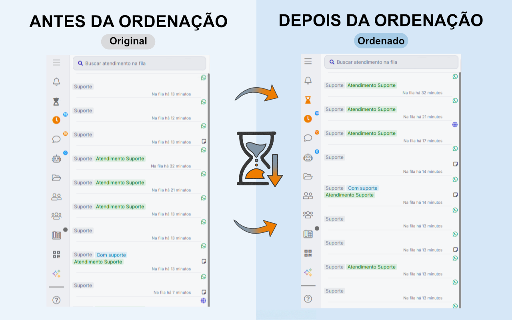
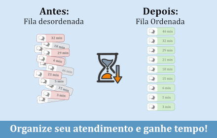
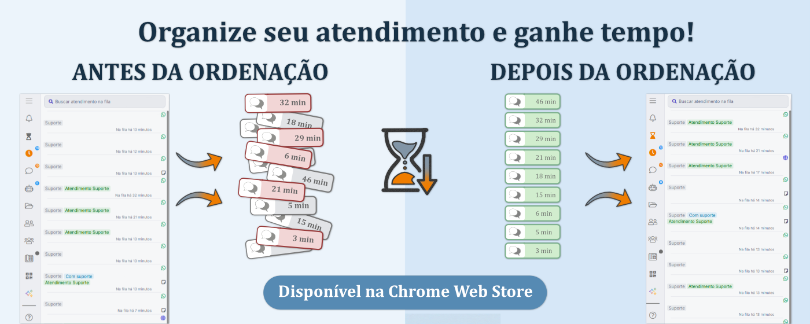
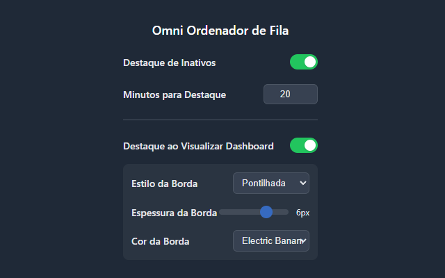
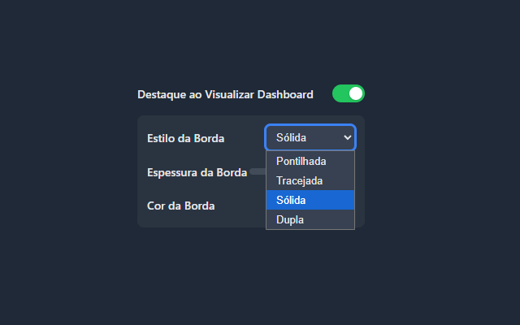
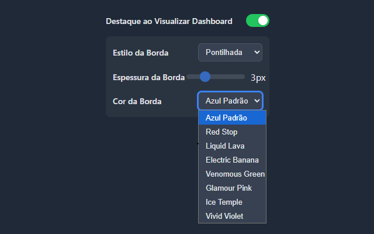

# 🚀 Omni - Ordenador de Fila & Monitor de Produtividade

 

Uma extensão para Google Chrome desenvolvida para otimizar o fluxo de trabalho de atendentes na plataforma Omni. A ferramenta permite ordenar filas de espera por tempo (antiguidade) e monitorar visualmente a inatividade em chats abertos.

> **Nota:** Esta é uma extensão independente e não possui vínculo oficial com a plataforma Omni.

---

##  Funcionalidades Principais

### 1. ⏳ Ordenação de Fila (Integração Nativa)
Chega de procurar visualmente quem está esperando há mais tempo.
- **Como funciona:** Um novo botão (ícone de ampulheta) é adicionado automaticamente ao **menu lateral esquerdo** do Omni, logo acima da opção "Aguardando".
- **O que faz:** Ao clicar, a extensão lê os horários dos cards (ex: "há 2 horas", "há 5 minutos") e reordena a lista instantaneamente, trazendo os casos mais antigos para o topo.

### 2. 🚨 Monitor de Inatividade (20Inativar)
Nunca mais se esqueça de um atendimento parado.
- **Monitoramento:** A extensão verifica a cada 10 segundos a lista de chats em andamento.
- **Alerta Visual:** Se a última mensagem (do cliente ou do agente) ultrapassar o tempo limite configurado, o card recebe uma **borda vermelha** e um fundo avermelhado para destaque imediato.
- **Inteligência:** O algoritmo detecta viradas de dia (ex: mensagem às 23:50 e agora são 08:00) para calcular o tempo corretamente.

### 3. 🎯 Foco em Atendimento (Destaque de Card)
Mantenha o contexto visual ao analisar um atendimento específico.
- **Como funciona:** Ao abrir o painel de detalhes de um atendimento e clicar em "Visualizar dashboard", a extensão automaticamente aplica um **destaque visual** no card correspondente na fila principal.
- **Persistência Inteligente:** O destaque permanece no card mesmo que você navegue para outras seções do Omni, ajudando a não perder o foco. O destaque é removido automaticamente ao fechar o painel de detalhes.

### 4. 🎨 Configurações Altamente Personalizáveis
Ajuste a extensão para se adequar perfeitamente ao seu fluxo de trabalho. Através de um popup moderno com tema escuro, você pode:
- **Monitor de Inatividade:**
    - Ativar ou desativar o destaque de cards inativos.
    - Definir o tempo (em minutos) para um card ser considerado inativo.
- **Destaque de Foco:**
    - Ativar ou desativar a função de destaque ao visualizar o dashboard.
    - Personalizar a aparência do destaque:
        - **Estilo da Borda:** Escolha entre pontilhada, tracejada, sólida ou dupla.
        - **Espessura da Borda:** Ajuste a espessura de 1 a 8 pixels com um controle deslizante.
        - **Cor da Borda:** Selecione sua cor preferida de uma paleta vibrante.

---

## 📸 Screenshots
 

### Personalização

---
##  Instalação (Chrome Store)

1. Acesse: [Omni - Ordenador de Fila](https://chromewebstore.google.com/detail/omni-ordenador-de-fila/gkgjbjjmemafdobnaddiihkijddojpij?authuser=0&hl=pt-BR)
2. clique em usar no Chrome
3. Vá até o Omni, no menu lateral terá um novo ícone (Ampulheta) em cima do botão da fila,
4. Clique na fila depois clique na ampulheta. Pronto sua fila está ordenada

## Instalação (Modo Desenvolvedor)

Como esta extensão é Open Source, você pode instalá-la manualmente:

1. Faça o **Download** deste repositório (Code → Download ZIP) e extraia a pasta.
2. No Google Chrome, acesse `chrome://extensions/`.
3. Ative o **Modo do desenvolvedor** no canto superior direito.
4. Clique em **Carregar sem compactação** (Load Unpacked).
5. Selecione a pasta onde você extraiu os arquivos.
6. Pronto! A extensão já está rodando no seu painel Omni.

---

## Tecnologias e Permissões

A extensão foi construída utilizando **Manifest V3**, **Vanilla JavaScript** com **HTML 5** e **Css 3**.

- **Permissões:**
    - `storage`: Necessário para salvar suas preferências de tempo e ativação (Popup) localmente no navegador.
    - `host_permissions`: Necessário para injetar o script `content.js` especificamente nos domínios da Omni para ler a estrutura da fila.
- **Privacidade:** A extensão roda 100% localmente (Client-side). Nenhum dado de cliente é coletado, armazenado ou enviado para servidores externos.

---

## Licença

Este projeto está licenciado sob a licença MIT - veja o arquivo [LICENSE](LICENSE) para mais detalhes.

---

### Apoie o projeto
Se esta extensão ajuda no seu dia a dia, considere deixar uma ⭐ estrela neste repositório!